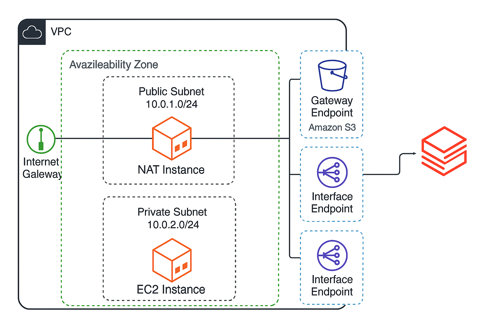

# From My Desk to Databricks: How I Built a Cost-Effective AWS Customer Managed VPC with a NAT Instance for Databricks

## 🌍 Real-Life Spark: Why I Built a CMVPC at Home

It started over a quiet weekend at home.

As a cloud architect constantly working with enterprise data platforms, I realized I needed something more hands-on, more raw than a managed sandbox. I wanted to simulate a **production-like AWS Databricks setup**—but in a **low-cost, fully controlled way**, without the usual enterprise cloud budget.

> Build a minimal, cost-optimized Databricks-ready AWS VPC with full private networking, just like in production.

## 🧩 Why Choose CMVPC for Databricks?

Databricks allows deployment in a **Customer Managed VPC**, where **you control the network**, endpoints, routing, and security.

### Benefits:

- 🔒 Data Governance
- ⚙️ Customization
- 🔄 Monitoring
- 💰 Cost Optimization
- 🧪 Lab Testing

## 💸 Why Not NAT Gateway? The Hidden Cost

| Component         | Monthly Cost |
|------------------|--------------|
| NAT Gateway      | $32          |
| NAT Instance     | $3           |
| Savings/month    | ~$29         |

## 🧱 VPC Architecture Overview

- **Region**: `eu-west-2`
- **One Availability Zone**
- **Public Subnet**: `10.0.1.0/24`
- **Private Subnet**: `10.0.2.0/24`

### Network Diagram




## 🛠️ NAT Instance Setup

```bash
#!/bin/bash
# Enable IP forwarding
echo "net.ipv4.ip_forward = 1" >> /etc/sysctl.conf
sysctl -p

# Setup NAT with nftables
dnf install -y nftables
systemctl enable --now nftables

cat <<EOF > /etc/nftables.conf
#!/usr/sbin/nft -f

table ip nat {
    chain postrouting {
        type nat hook postrouting priority 100;
        oifname "eth0" masquerade
    }
}
EOF

systemctl restart nftables
```

## 🔌 Add VPC Endpoints

### Gateway Endpoint

- `com.amazonaws.eu-west-2.s3`

### Interface Endpoints

- logs
- monitoring
- ssm
- ec2messages
- ssmmessages

## 📦 CloudFormation

### EC2 Creation

```yaml
Resources:
  MyPrivateEC2:
    Type: AWS::EC2::Instance
    Properties:
      InstanceType: t3.micro
      ImageId: ami-0abcdef1234567890
      SubnetId: subnet-0abcde1234567890
      KeyName: my-key
```

### Interface Endpoint

```yaml
Resources:
  SSMEndpoint:
    Type: AWS::EC2::VPCEndpoint
    Properties:
      VpcId: vpc-0abcdef1234567890
      VpcEndpointType: Interface
      ServiceName: com.amazonaws.eu-west-2.ssm
      SubnetIds:
        - subnet-0abcde1234567890
      SecurityGroupIds:
        - sg-0abcde1234567890
      PrivateDnsEnabled: true
```

## 🔐 IAM Role

```json
{
  "Version": "2012-10-17",
  "Statement": [
    {
      "Effect": "Allow",
      "Principal": {
        "AWS": "arn:aws:iam::<databricks-account-id>:root"
      },
      "Action": "sts:AssumeRole",
      "Condition": {
        "StringEquals": {
          "sts:ExternalId": "<databricks-external-id>"
        }
      }
    }
  ]
}
```

## 🔐 Security Groups: Inbound & Outbound Rules

Security Groups are critical for controlling access to your EC2 instances. Here’s how I set them up:

### 🔓 NAT Instance Security Group (Public Subnet)

- **Inbound:**
  - `SSH (22)` from `My IP` → for admin access
  - `ICMP` from `Private Subnet` → for health checks
- **Outbound:**
  - `All traffic (0.0.0.0/0)` → to allow NAT forwarding

### 🔐 Private EC2 Security Group

- **Inbound:**
  - `All traffic` from `NAT SG` → for internal communication
- **Outbound:**
  - `All traffic (0.0.0.0/0)` → to enable internet access via NAT

## 🌐 Internet Gateway (IGW) Routing

- **Public Subnet**
  - Attached to an **Internet Gateway**
  - Route Table includes:
    - `0.0.0.0/0` → IGW

- **Private Subnet**
  - No direct IGW
  - Route Table includes:
    - `0.0.0.0/0` → NAT Instance (via instance ID)

This routing ensures only the **NAT instance** talks to the internet, keeping your **private subnet secure** and isolated.


## 🧪 Test: SSH & Internet from Private Subnet

### Step 1: Connect to NAT/Bastion in Public Subnet

```bash
ssh -i my-key.pem ec2-user@<NAT-Instance-Public-IP>
```

### Step 2: SSH into Private EC2 from NAT

```bash
ssh -i my-key.pem ec2-user@<Private-EC2-Private-IP>
```

> (Ensure Security Group of private EC2 allows inbound SSH from NAT's private IP or SG)

### Step 3: Test Internet Access

```bash
curl https://www.google.com
```

✅ Successful response confirms NAT instance routing and internet access from private EC2.


If HTML is returned — **NAT is forwarding correctly**, and **private instance has internet**.

---

## 🛡️ Why This Setup Works

- Security Groups enforce **minimum required access**
- Internet Gateway used only where necessary (public subnet)
- Private subnet has **no direct internet** — traffic is routed via **controlled NAT**
- Ingress is restricted — **only SSH from admin IPs**

This is aligned with **AWS Well-Architected** security best practices.


## 🔐 Security Groups: What, Why, and How

Security Groups act as virtual firewalls for your instances.

### NAT Instance Security Group (Public Subnet)
- **Inbound Rules**:
  - `TCP 22` (SSH) — From your IP only (e.g. `203.0.113.10/32`)
  - `ICMP` — For ping (optional, useful for testing)
- **Outbound Rules**:
  - `All traffic` — Required to allow forwarding of NAT traffic to the internet

### Private EC2 Instance Security Group (Private Subnet)
- **Inbound Rules**:
  - `None` (unless SSH access from jumpbox/NAT EC2 or Session Manager is needed)
- **Outbound Rules**:
  - `All traffic` — Required for outbound internet access via NAT

### Why These Rules?
These rules **minimize the exposed surface** while still allowing essential management and internet access.

---

## 🌐 Internet Gateway and Routing

### Internet Gateway

- An **Internet Gateway (IGW)** is attached to the VPC.
- It allows traffic from instances in the **public subnet** to reach the internet.

### Public Subnet Routing Table

- Route: `0.0.0.0/0 → Internet Gateway`
- Used by:
  - NAT instance
  - Bastion host (if used)

### Private Subnet Routing Table

- Route: `0.0.0.0/0 → NAT Instance`
- This allows **outbound internet traffic from private EC2s** via the NAT instance

---

---
## 🔗 Next Step

Subscribe to Databricks on AWS Marketplace and connect to your CMVPC.

## 🧪 Final Thoughts

✅ Real-world testing, ✅ Cost control, ✅ Perfect for labs.

---

